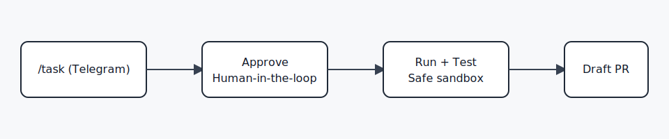

# OkayDokki

[](#ci)


Text your coding agent from Telegram. Approve changes, run safely, and ship via Draft PRs.

OkayDokki is a human-in-the-loop AI code delivery agent. It turns chat commands into auditable code changes with mandatory approval and PR-only output.

## Why OkayDokki

- Approval-first: no write/run without explicit approve.
- Safe-by-default: sandbox execution and policy guards.
- PR-first delivery: no direct push to `main`.

## 30-Second Flow

1. Send `/task ...` in Telegram.
2. Choose strategy (`rolling` / `isolated`) or use your saved default.
3. Approve the task.
4. OkayDokki runs tests and opens a Draft PR.

## Quick Start (10 min)

1. Install dependencies:

```bash
npm install
```

2. Prepare env file:

```bash
cp .env.example .env
```

3. Set minimum required `.env` values:

- `TELEGRAM_BOT_TOKEN`
- `DEFAULT_REPO`
- `AGENT_CLI_TEMPLATE`

4. Initialize DB:

```bash
npm run db:init
```

5. Run checks:

```bash
npm run preflight
```

6. Start service:

```bash
npm run dev
```

7. In Telegram, send your first task:

```text
/task repo=okd-sandbox append one line "Updated by OkayDokki" to README.md and keep npm test passing
```

## Telegram Commands

- `/task repo=<repo> <intent>`: create executable task.
- Approval message is a 4-line compact summary by default; tap `Details` for full policy and full intent.
- `/task status <task_id>`: check one task status.
- `/last`: show latest task summary.
- `/rerun <task_id>`: rerun as a new task.
- `/strategy`: show your current strategy preference.
- `/strategy rolling|isolated`: set your strategy preference.
- `/strategy clear`: clear strategy preference.
- `/chat ...`: chat-only ideation mode.
- `/chat repo=<repo> ...`: chat against a specific repo snapshot.
- `/chat reset`: clear chat short-memory.
- `/chat cancel`: cancel active chat request.

## Minimal Config

- `TELEGRAM_MODE` (`polling` recommended for self-hosted)
- `TELEGRAM_BOT_TOKEN`
- `DEFAULT_REPO`
- `AGENT_AUTH_MODE` (`session` recommended)
- `AGENT_CLI_TEMPLATE`
- `DELIVERY_STRATEGY` (`rolling` or `isolated`)
- `BASE_BRANCH` (usually `main`)

## Safety Defaults

- Approval required before write/run.
- Draft PR only.
- Diff policy guard (blocked paths, size/file limits, binary controls).
- Full audit log in `audit.jsonl`.

## Known MVP Limits

- `rolling` mode behaves like stacked PR workflow.
- `/chat` is short-memory assistance, not autonomous execution.
- Current focus is Telegram-first self-hosted deployment.

## More Docs

- Contracts:
  - `docs/contracts/task-lifecycle.md`
  - `docs/contracts/gateway-api.md`
- Runbooks:
  - `docs/runbook-live-test.md`
- Provider auth:
  - `docs/provider-auth.md`

## CI

CI is enabled via GitHub Actions (`.github/workflows/ci.yml`) and runs `npm ci`, `npm run typecheck`, and `npm run build`.

## License

Apache License 2.0 (`Apache-2.0`). See `LICENSE`.
