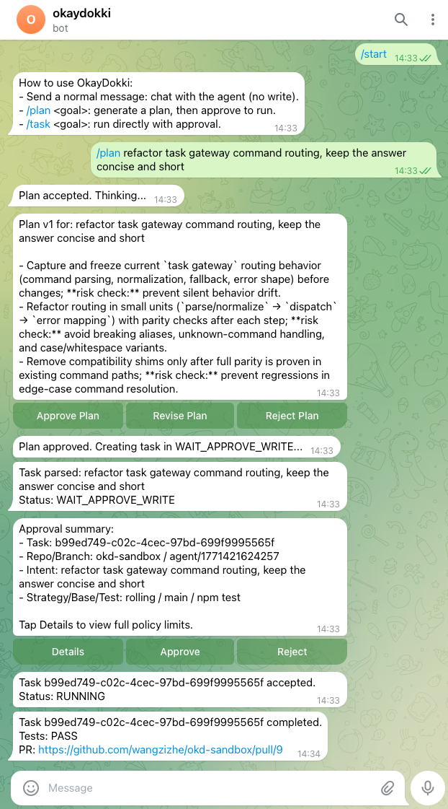
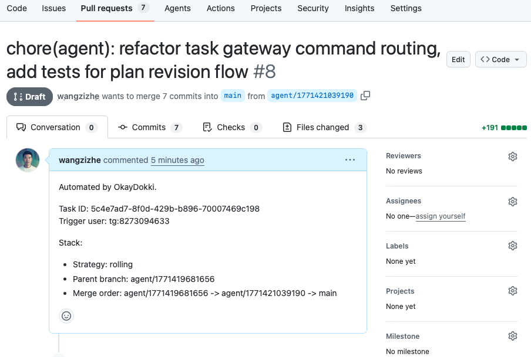

# OkayDokki

<p align="center">
  <a href="https://github.com/wangzizhe/OkayDokki/actions/workflows/ci.yml" style="text-decoration:none;"></a>&nbsp;
  <a href="LICENSE" style="text-decoration:none;"></a>&nbsp;
  <a href="https://nodejs.org/" style="text-decoration:none;">= 22" /></a>
</p>
Text your AI agent. Work from anywhere, anytime. 

Approve safely, run in sandbox, ship via Draft PRs.

OkayDokki is a human-in-the-loop AI code delivery agent for Telegram:
- chat and plan like you talk to a developer,
- require explicit approval before write/run,
- deliver only through Draft PRs with audit logs.

---

Message your AI agent from anywhere, anytime.



It works in a sandbox and opens a Draft PR. You approve before merge.



## Quick Start

1. Install dependencies

```bash
npm install
```

2. Create env file

```bash
cp .env.example .env
```

3. Set minimal required env

- `TELEGRAM_BOT_TOKEN`
- `DEFAULT_REPO`
- `AGENT_CLI_TEMPLATE`
- `REPO_SNAPSHOT_ROOT`

4. Add 2 repo runtime files (copy-paste templates)

Put these files in your target repo root (example: `/Users/meow/Documents/GateForge`):

`Dockerfile.okd`

```dockerfile
# Pick ONE base image that matches your stack:
# - Node:   FROM node:22-bookworm-slim
# - Python: FROM python:3.12-slim
# - Other/custom: FROM ubuntu:24.04
FROM python:3.12-slim

ENV DEBIAN_FRONTEND=noninteractive
RUN apt-get update && apt-get install -y --no-install-recommends \
    ca-certificates curl git bash build-essential \
  && rm -rf /var/lib/apt/lists/*

WORKDIR /work
```

Build it once:

```bash
docker build -f Dockerfile.okd -t gateforge-okd:latest .
```

`okaydokki.yaml`

```yaml
sandbox_image: gateforge-okd:latest
test_command: python3 -m unittest discover -s tests -v
allowed_test_commands:
  - python3 -m unittest discover -s tests -v
```

5. Init DB

```bash
npm run db:init
```

6. Check runtime prerequisites

```bash
npm run preflight
```

7. Start service

```bash
npm run dev
```

## Key Concepts

- Runtime mode: `TELEGRAM_MODE=polling` (recommended for self-hosted)
- Agent config: `AGENT_PROVIDER` + `AGENT_CLI_TEMPLATE` (+ optional `AGENT_AUTH_MODE=session`)
- Repo routing: `REPO_SNAPSHOT_ROOT` + `DEFAULT_REPO`
- Delivery strategy: `DELIVERY_STRATEGY=rolling|isolated`, base via `BASE_BRANCH`
- Safety by default: approval before write/run, draft PR only, diff policy guards, full audit log (`audit.jsonl`)

## Provider Presets

Pick one provider and copy its preset into `.env`.
These presets are examples; verify flags against your installed CLI version.

### Codex (CLI session login)

```env
AGENT_PROVIDER=codex
AGENT_CLI_TEMPLATE=/Applications/Codex.app/Contents/Resources/codex exec --skip-git-repo-check --sandbox workspace-write "$OKD_INTENT"
AGENT_SESSION_CHECK_CMD=/Applications/Codex.app/Contents/Resources/codex login status
```

### Claude (example template)

```env
AGENT_PROVIDER=claude
AGENT_CLI_TEMPLATE=claude "$OKD_INTENT"
AGENT_SESSION_CHECK_CMD=claude --version
```

### Gemini (example template)

```env
AGENT_PROVIDER=gemini
AGENT_CLI_TEMPLATE=gemini "$OKD_INTENT"
AGENT_SESSION_CHECK_CMD=gemini --version
```

Notes:
- For Claude/Gemini, replace only the CLI binary/flags to match your local install.
- Keep `"$OKD_INTENT"` in the command so task intent is passed to the agent.

## Telegram Usage

### 1) Normal message (Chat)
Send a plain message (without command) to discuss ideas, tradeoffs, and next steps.

### 2) `/plan ...` (Plan first, then run)
Generate a plan, then choose:
- `Approve Plan` -> create task and run
- `Revise Plan` -> reply with feedback to get `v2`, `v3`, ...
- `Reject Plan` -> close this plan session

Example:

```text
/plan repo=okd-sandbox refactor task gateway and add tests
```

### 3) `/task ...` (Run directly)
Create executable task directly (still requires approval before write/run).

Example:

```text
/task repo=okd-sandbox add one line "Updated by OkayDokki" to README.md and keep npm test passing
```

## Commands

- `/task repo=<repo> <goal>`: run directly (approval required)
- `/plan repo=<repo> <goal>`: plan first, then approve to run
- `/rerun <task_id>`: rerun as a new task
- `/task status <task_id>`: show task status

More command examples: `docs/runbook-live-test.md`

## Live Demo Script (5 min)

Run service:

```bash
npm run dev
```

Then in Telegram, run:

1. Plan request:

```text
/plan repo=okd-sandbox refactor task gateway routing and add tests for plan revision flow
```

2. Direct task:

```text
/task repo=okd-sandbox add one line "Updated by OkayDokki" to README.md and keep npm test passing
```

Expected outcome:
- Task reaches `COMPLETED` or `FAILED` with reason
- Tests result is reported
- Draft PR link appears when diff is non-empty and PR creation succeeds

## Failure Guide

| Code | Meaning | Action |
|---|---|---|
| `POLICY_VIOLATION` | Diff violates policy (blocked path, size/files limit, or binary patch) | Reduce task scope or adjust `.env` policy limits |
| `AGENT_FAILED` | Agent CLI execution failed | Verify `AGENT_CLI_TEMPLATE` and provider login/session |
| `SANDBOX_FAILED` | Sandbox validation/test failed | Verify Docker/image and allowed test command |
| `PR_CREATE_FAILED` | Draft PR creation failed | Verify git push permission and `gh auth status` |

## Operations

- Upgrade
  - `git pull && npm install && npm run db:init`
- Restart
  - Stop current process, then run `npm run dev`
- Backup DB and audit log
  - `cp okaydokki.db backup-okaydokki.db && cp audit.jsonl backup-audit.jsonl`

## Design Philosophy

- `docs/philosophy.md`

## Changelog

- `CHANGELOG.md`

## License

Apache License 2.0 (`Apache-2.0`). See `LICENSE`.

## Docs

- `docs/runbook-live-test.md`
- `docs/checklists/regression.md`
