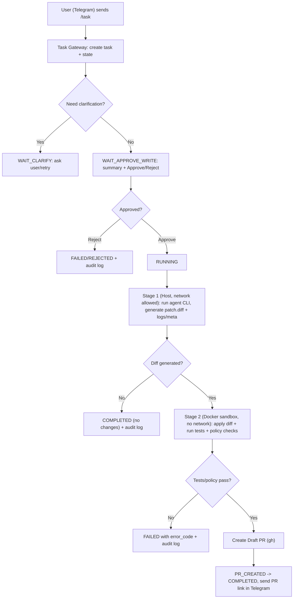

# OkayDokki

OkayDokki is a human-in-the-loop AI code delivery agent.
Users submit tasks through IM (Telegram first), and the agent runs inside a restricted sandbox to generate a patch diff.
Any write action requires explicit approval before apply, and delivery is always through a Draft PR.
All actions are auditable by design with strict default safety boundaries (read-only source, no network, no direct push).

## MVP Stack

- IM: Telegram Bot API (`polling` default for self-hosted, `webhook` optional)
- Task store: SQLite
- Sandbox: Docker read-only mount + overlay write
- Agent adapter: CLI (Codex, Claude Code, etc.)
- PR creation: GitHub CLI (`gh pr create --draft`)
- Audit: JSONL event log

## Core Principles

- Human in the loop
- Default deny for writes
- PR-only delivery
- Full auditability
- Pluggable adapters

## Why OkayDokki (Detailed Differentiation)

Most AI coding tools optimize for coding speed in IDE or chat.  
OkayDokki optimizes for **controlled code delivery in production teams**.

Positioning in one line:

- "Chat-first agent orchestration with mandatory human approval and PR-only delivery."

### Category-Level Comparison

| Category | Representative products | What they optimize for | OkayDokki difference |
|---|---|---|---|
| IDE coding agents | Cline, Roo Code, Kilo Code, Claude Code, OpenHands | Fast local coding inside editor loops | OkayDokki is IM-first (Telegram), approval-first, and PR-first for remote/team workflows |
| API/model gateway layers | LiteLLM, New API | Unified model routing and provider abstraction | OkayDokki is not a model gateway; it is a task-to-PR execution system with approval and audit controls |
| General AI/chat agents | OpenClaw, BLACKBOXAI, Agent Zero | Broad autonomous assistance and generation | OkayDokki narrows scope to software delivery with strict write gates and deterministic workflow states |
| Consumer character/chat products | Janitor AI, Chub AI, SillyTavern, HammerAI, ISEKAI ZERO, LoreBary | Roleplay, social chat, creator ecosystems | Different problem space; OkayDokki focuses on engineering governance and CI-ready delivery |
| Creative/media tools | Descript, VidMuse, Lemonade | Media creation/editing | Different domain; OkayDokki is code change lifecycle automation |
| Games/sandboxes | Pax Historia | Interactive gameplay/simulation | Different domain; OkayDokki is infra and workflow for software teams |

### Capability Comparison (What "Safe by Default" Means)

| Capability | Typical coding agent product | OkayDokki |
|---|---|---|
| Main interaction surface | IDE panel or web app | Telegram-first IM control |
| Write behavior | Immediate edit/run is common | Default deny; explicit Approve/Reject required |
| Execution boundary | Tool-dependent | Docker sandbox (`--network none`, read-only repo snapshot) |
| Artifact of record | Files or commits | Draft PR as default delivery artifact |
| Governance model | Optional team process | Built-in state machine + mandatory approval checkpoint |
| Audit quality | Partial logs in many tools | Structured JSONL audit events (request/decision/run/pr/result) |
| Policy enforcement | Limited/implicit in many tools | Diff policy gate (blocked paths, binary patch block, size/file limits) |
| Failure semantics | Often tool-specific | Typed error codes (`SNAPSHOT_MISSING`, `POLICY_VIOLATION`, etc.) |
| Re-run path | Usually manual retries | First-class rerun via API and Telegram (`/rerun`) |

### Strategic Differentiators

- IM-native operations: open a task, approve/reject, and track status from chat without entering IDE.
- Human-in-the-loop by design: no hidden auto-write path.
- PR-only output: aligns with existing code review, branch protection, and compliance workflows.
- Security baseline included: sandbox isolation + no network + read-only source mount.
- Auditability as a product feature: decision trail, run metadata, diff hash, and outcomes are persisted.
- Adapter-pluggable architecture: Codex/Claude via CLI today; can extend to HTTP/GitHub Action adapters later.

In short: OkayDokki is built for teams that want AI execution speed **without giving up reviewability, control, and traceability**.

## Task State Machine

```text
WAIT_CLARIFY
  -> WAIT_APPROVE_WRITE
  -> FAILED
WAIT_APPROVE_WRITE
  -> RUNNING
  -> FAILED
RUNNING
  -> PR_CREATED
  -> COMPLETED
  -> FAILED
PR_CREATED
  -> COMPLETED
  -> FAILED
```

Note:

- `CREATED` exists as a conceptual state in design docs; current runtime creates tasks directly as `WAIT_CLARIFY` or `WAIT_APPROVE_WRITE`.

## Execution Flow (LLM + Safe Sandbox)



Design intent:

- Stage 1 is proposal generation (LLM/agent).
- Stage 2 is constrained validation and enforcement (safe execution boundary).

## Quick Start

1. Copy `.env.example` to `.env`.
2. For personal self-hosted setup, keep `TELEGRAM_MODE=polling`.
3. Fill required values.
   - Always required: `TELEGRAM_BOT_TOKEN`, `AGENT_CLI_TEMPLATE`
   - Required only in webhook mode: `TELEGRAM_WEBHOOK_SECRET`, `BASE_URL`
4. Prepare repository snapshots under `REPO_SNAPSHOT_ROOT`.
   Example for `repo=org/name`: `${REPO_SNAPSHOT_ROOT}/org/name`.
5. Install dependencies:

```bash
npm install
```

6. Initialize DB:

```bash
npm run db:init
```

7. Run preflight checks:

```bash
npm run preflight
```

8. Start service:

```bash
npm run dev
```

9. Run tests:

```bash
npm test
```

## Fast Start (Tomorrow)

```bash
npm run preflight
npm run db:init
npm run dev
curl -s http://localhost:3000/api/v1/health/details | jq
# Then send /task in Telegram
```

## Telegram Run Modes

- `polling` (default, recommended for personal deployment):
  - no public domain required
  - no HTTPS certificate required
  - easiest local bring-up
- `webhook` (optional, recommended for always-on server deployment):
  - requires public HTTPS endpoint
  - set `BASE_URL` and `TELEGRAM_WEBHOOK_SECRET`
  - endpoint path: `/webhook/telegram`

## Agent Auth Modes

- `session` (default, recommended for self-hosted):
  - use your local provider CLI login (subscription/session)
  - no provider API key storage required by OkayDokki
  - optionally set `AGENT_SESSION_CHECK_CMD` for preflight login-state checks
- `api` (optional):
  - use provider API keys
  - useful for centralized team deployment

See `docs/provider-auth.md` for setup details.

## MVP Scope in This Repository

- Task intake and persistence
- Explicit approval gate before write/run
- Missing snapshot guard (`WAIT_CLARIFY` before approval)
- Retry button to move `WAIT_CLARIFY` -> `WAIT_APPROVE_WRITE` after snapshot is ready
- Telegram callback flow (`Approve` / `Reject`)
- Telegram rerun command (`/rerun <task_id>`)
- Auditable JSONL event stream
- Runner and adapter interfaces with safe defaults
- Draft PR creation hook
- Docker sandbox execution (`--network none`, read-only repo mount)

## Security Defaults

- No direct writes without approval
- Sandbox execution boundary (read-only + no-net)
- Restricted command surface for tests
- Draft PR only

## Sandbox Notes

- Agent command is configured by `AGENT_CLI_TEMPLATE`.
- Agent auth mode is configured by `AGENT_AUTH_MODE` (`session` by default).
- In `session` mode, you can set `AGENT_SESSION_CHECK_CMD` to validate login state during preflight.
- Recommended style:
  - use injected `$OKD_*` environment variables directly in the command.
- Example:
  - `codex exec --task "$OKD_INTENT"`
- Backward-compatible placeholder tokens are also supported:
  - `{{task_id}}`, `{{intent}}`, `{{repo}}`, `{{branch}}`, `{{trigger_user}}`
- Runtime environment variables injected by runner:
  - `OKD_TASK_ID`
  - `OKD_REPO`
  - `OKD_BRANCH`
  - `OKD_TRIGGER_USER`
  - `OKD_INTENT`
  - `OKD_WORKDIR=/work`
  - `OKD_OUTDIR=/out`
- The agent command runs inside Docker against `/work`.
- Diff is generated automatically as `/out/patch.diff` by comparing `/repo` and `/work`.
- Optional metadata file: `/out/agent.meta.json` (flat string JSON object).
- Test command is enforced by `ALLOWED_TEST_COMMANDS`.
- Empty diff skips PR creation.
- Test failure marks task as `FAILED`.
- Diff policy gate blocks unsafe PR candidates (blocked paths, binary patches, oversized diffs).
- Approval step includes a concise policy summary before `Approve`.

## Error Codes

Common `error_code` values you will see during integration:

- `SNAPSHOT_MISSING`
- `POLICY_VIOLATION`
- `TEST_FAILED`
- `PR_CREATE_FAILED`
- `SANDBOX_FAILED`

Full list and API error schema:

- `docs/contracts/gateway-api.md`

## Internal API

- `POST /api/v1/tasks`
- `GET /api/v1/tasks`
- `GET /api/v1/tasks/:taskId`
- `POST /api/v1/tasks/:taskId/actions`
- `POST /api/v1/tasks/:taskId/rerun`
- `GET /api/v1/health/details`

Contracts:

- `docs/contracts/task-lifecycle.md`
- `docs/contracts/gateway-api.md`
- `docs/contracts/agent-adapter.md`
- `docs/contracts/audit-log.md`

Runbooks:

- `docs/runbook-live-test.md`
- `docs/runbook-api-smoke.md`
- `docs/checklist-live-integration.md`

## CI

Minimal CI is enabled via GitHub Actions:

- `npm ci`
- `npm run typecheck`
- `npm run build`

Workflow file:

- `.github/workflows/ci.yml`

## License

Apache License 2.0 (`Apache-2.0`). See `LICENSE`.
